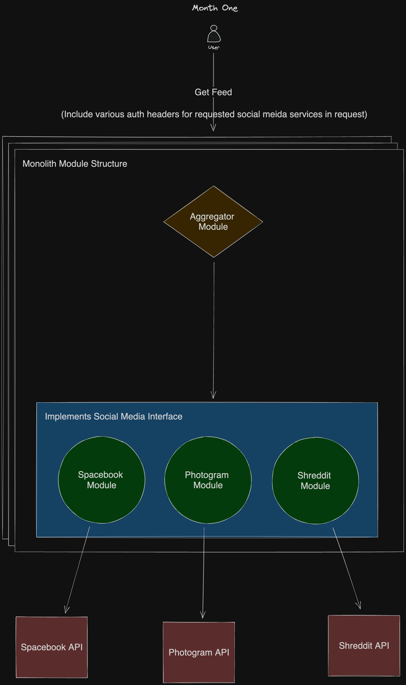

# One Month Design Proposal

## Performance Requirements

Expected Traffic: 100,000 Daily Active Users (DAU)
Peak Time: 12:00 PM to 2PM and 6:00 PM to 9:00 PM (local time)
Peak Usage Stats: 50,000 Concurrent Users
Response Time: 500 milliseconds for essential operations during normal traffic

## High Level Architecture

The first iteration of the architecture is relatively simple. In order to keep both implementation and
architectural complexity low, the idea is to build everything in a monolithic codebase that will run
in the same server process. Even though we will keep code co-located the service will be designed as
if it were implemented in different, independent services. Initially this could be in the form of different
modules split across domain boundaries. This service can be deployed as a docker container in a managed
container service like AWS ECS/Fargate or Google Cloud Run or even as an AWS Lambda function deployed
as a container.

## Domain Boundaries

The main services or modules that will be implemented and integrated together will be an Aggregator
Service (Aggregator) and various Social Media Services (SMS).

### Aggregate Service

The job of the aggregator is to act as a gateway to the different SMS by receiving requests from the
user, determining which social media feeds the user wishes to see, make the appropriate calls or requests
to the specified SMS and aggregate the feeds together to be returned to the user.

### Social Media Service

A Social Media Service will act a s a proxy to a specific social media API while implementing a common
interface. The implementation of each service will be responsible for making API read requests for a
user's social media feed, transforming the data into a shared data model, and returning it to the caller
(Aggregator in most instances).

Different social media API's represent data in very different ways. One API could provide its data in
a graph based model, while other could have a flatter, resource oriented data model. This is the key
reason an SMS will need to transform its data to a more commonly understood data model.

#### Pros

By implementing a common API interface for each SMS we can achieve a simple integration process into
the aggregator. Since the SMS is concerned with the different complexities and implementation details
of its associated Social Media API, the Aggregator will only need to know of its availability to be called
and make requests like it would for any other SMS.

This also allows us to swap in new implementations for an SMS without much trouble as well as build
mock services for development and testing purposes.

#### Cons

Designing a common interface for a wide range of social media data models will introduce some complexities
as we try to achieve a scalable unionized data model. For that reason, extracting only the data needed
for aggregating different feed types is necessary when transforming the data and the raw data can be included
as-is for the client application to determine how its used.

### Data Model

Below is simple concept for a Data model representing an Aggregator Service and the transformed social
media feed data it aggregates.


```ts
// Collection of feed items from SMS
type Feed = {
  service: string; // Identifier for the service this feed came from (Spacebook, Photogram, Shreddit)
  cursor: string; // Ending feed item identifier used to retrieve next feed page;
  items: FeedItem[];
}

// FeedItem acts as a common data model that each SMS would transform its feed items into
// from its API response. This is simply for example purposes and would include much more
// data.
type FeedItem = {
  timestamp: Date; // Timestamp used for aggregation sorting
  service: string; // Which service did this feed come from
  data: object; // Raw data received from the SMS
}

// An SMS would implement this by making direct API calls at first but could
// be refactored to make those calls to an SMS proxy service running in a different
// container/cloud in the future
interface SocialMediaService {
  getFeed(userId: string): Feed;
  auth(token: string): unknown; // this will be covered in a different section
}

type AggregateFeed = {
  items: FeedItem[];
}

interface AggregateService {
  getFeed(cursor: string): AggregateFeed;
}
```


